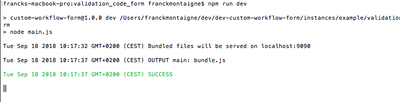
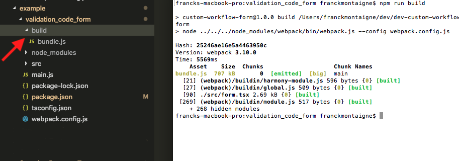
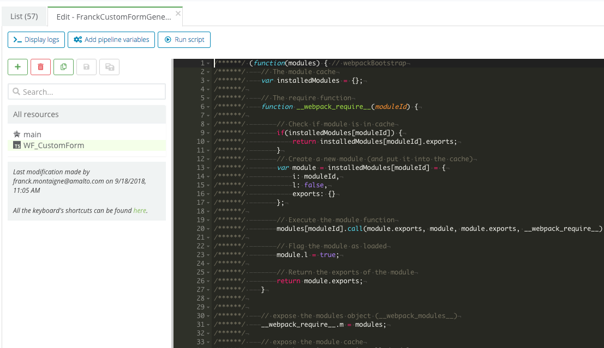
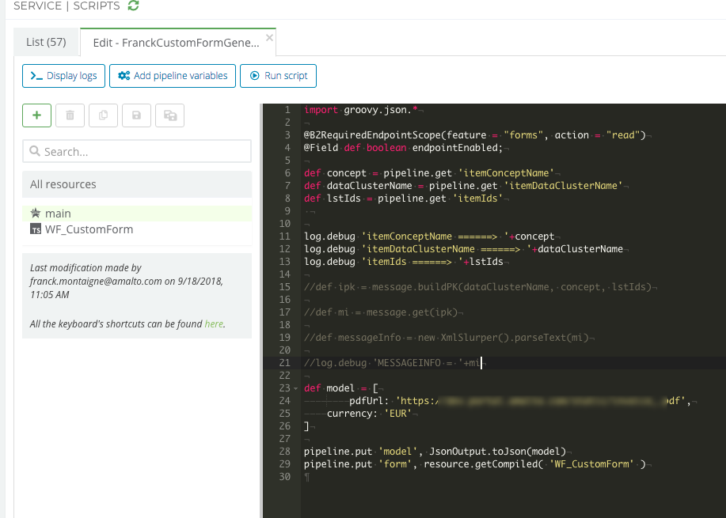

# Custom Workflow Forms

This project should be used to build any custom workflow form. It allows importing any third party npm library and/or any component used in the Platform 6 Portal to build a custom UI for a _Work Item_ in the Portal.

A custom workflow form is often pre-populated with some data, provided by a _Script_ in a JSON format.


## Getting Started

First, make sure you have `node` and `npm` installed and usable via the command line. (I recommend using the latest LTS version of node which can be downloaded from [here](https://nodejs.org/en/)).

I recommend using [Visual Studio Code](https://code.visualstudio.com/) as source code editor. It works great with TypeScript and React.

You also need to have the port `9090` available on your computer.


Clone the repo and run the following command in the project root


```
npm install
```


## Demo Form

You can quickly run a **demo** form with the following steps:

- Go to the _example-form_ folder
- Run the following commands


```
npm install
npm run dev
/* it will start a small server with your UI on localhost:9090, which can be read by the Portal */
```


It should look like this:





See the following section to view the UI in the Platform6 Portal.


## Testing

To be able to test how your UI will render quickly in the Portal:

- You can go on the Platform6 Portal and click on the **Local UI Test** menu entry
	- It will ask you to input a JSON object. This is to "simulate" the data provided by the _Script_ which generates the custom workflow form when triggering the work item. You can leave it as an empty JSON object if your custom form doesn't require any injected data.
- Keep in mind you won't be able to trigger you work item task with this testing menu entry. It only allows you to see how it renders and interact with the form you created. To be able to test it from end to end, you need to deploy it.

Use the following _Demo JSON Data_ (copy-paste it) in the _Import Data_ popup of the testing tool.

### Demo JSON Data

```
{
    "pdfUrl":"https://www.google.com/",
    "currency": "USD"
}
```

## Development process - Creating a new Form

At this stage you probably just want to start from the content of the example-form folder. You can edit the _form.tsx_ file and use **npm** to add more components and other third party libraries.

Kill the server before doing that and then restart it with `npm run dev`.

Custom Workflow Forms UI can be created using the same components as the Custom Services UI. You can go see the documentation [here](https://documentation.amalto.com/platform6/latest/reference/custom-services/platform6-ui-components/).

Use the testing tool (Testing section) on the Platform6 Portal to quickly see how your updates will be rendered to the user. 


## Deploying your custom form

When you are happy with the way your UI renders, you can deploy it by generating a build file. Kill the dev server and run the following command:


```
npm run build
```





You should get a **bundle.js** file in the _build_ folder. To deploy your form, copy paste the content of this file in the Scripts Service of the Platform6 instance in a dedicated resource.
You can either use a _TYPESCRIPT_ resource type and use the _getCompiled_ util in the Script (this is used in the example below - see screenshots) or user a _TEXT_ resource type with the _get_ util in the Script.



Screenshot - Copying the _bundle.js_ file content



Screenshot - Getting the resource in the Script. You can also see how the JSON data is injected into the form via the **model** pipeline variable.